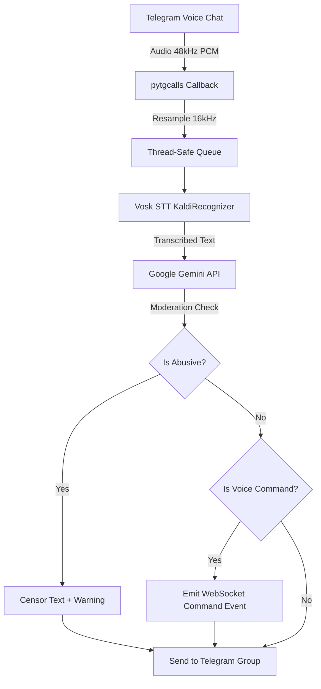

<div align="center">

# 🎙️ VoiceSraver Bot

<a href="https://git.io/typing-svg"></a>

**The ultimate real-time voice chat transcription and AI command bot for Telegram.**

<p align="center">
  <a href="#"></a>
  <a href="#"></a>
  <a href="#"></a>
  <a href="#"></a>
  <a href="#"></a>
</p>

</div>

---

## ✨ Features

- 🎧 **Live VC Transcription:** Joins Telegram voice chats and provides real-time speech-to-text using Vosk (Offline STT).
- 🧠 **AI Voice Commands:** Uses **Google Gemini** to extract intents like `"play"`, `"pause"`, `"skip"` directly from spoken text.
- 🛡️ **Smart Moderation:** AI detects toxic/abusive language contextually and auto-censors bad words while issuing group warnings.
- 🎵 **Music Bot Integration API:** REST API endpoints (`/api/pause`, `/api/resume`) to seamlessly integrate with your existing music bots without audio conflicts.
- 🔌 **WebSocket Streaming:** Broadcasts transcription and AI events in real-time.
- 🐳 **Docker Ready:** Deploy in 1 minute using `docker-compose`.

---

## 🏗️ Architecture



## 🚀 1-Click Deployment (Free 24/7)

Deploy instantly on Heroku or Render. The bot includes an internal **24/7 keep-alive trick** so it never sleeps on free tiers! *(Just set the `PING_URL` environment variable to your app's public URL in the dashboard).*

<p align="left">
  <a href="https://heroku.com/deploy?template=https://github.com/SUDEEPBOTS/VOICECAMND"></a>
  <a href="https://render.com/deploy?repo=https://github.com/SUDEEPBOTS/VOICECAMND"></a>
</p>

---

## 🐳 Quick Setup (Docker - Recommended)

The easiest way to run the bot is using Docker. It automatically handles `ffmpeg` and dependencies.

### 1. Clone & Configure
```bash
git clone https://github.com/SUDEEPBOTS/VOICECAMND.git
cd VOICECAMND
cp .env.example .env
```

### 2. Edit `.env`
Fill in your credentials from [my.telegram.org](https://my.telegram.org) and [Google AI Studio](https://aistudio.google.com/):
```env
API_ID=12345678
API_HASH=your_api_hash_here
STRING_SESSION=your_pyrogram_session_string
GEMINI_API_KEY=your_gemini_api_key
```
> **Tip:** You can generate a string session by running `python gen_session.py` locally.

### 3. Run
```bash
docker-compose up -d
```

---

## 💻 Manual Setup (VPS / Linux)

### 1. Install System Requirements
```bash
sudo apt update
sudo apt install -y ffmpeg unzip wget build-essential cmake python3-dev
```

### 2. Install Python Dependencies
```bash
python3 -m venv venv
source venv/bin/activate
pip install -r requirements.txt
```

### 3. Download Speech Model
```bash
bash download_model.sh
```

### 4. Start Server
```bash
python main.py
```

---

## 🔌 API & Integration

### REST Endpoints
Integrate VoiceSraver with your Music Bot:
- `POST /api/pause` - Call this **before** your music bot starts playing audio.
- `POST /api/resume` - Call this **after** your music bot finishes a song.
- `GET /api/status` - Check bot status and queue size.
- `POST /api/mute` / `/api/unmute` - Control bot mic.

### WebSocket
Connect to `ws://localhost:8000/ws/transcription` to receive live JSON events:
```json
{
  "type": "event",
  "event": "voice_command",
  "data": {
    "chat_id": -100123456,
    "command": "play",
    "song_name": "Shape of You"
  }
}
```

---

## 📋 Telegram Commands

| Command | Description |
|---------|-------------|
| `/joinvc` | Join voice chat & start transcription |
| `/leavevc` | Leave voice chat & stop transcription |
| `/vcstatus` | Check bot status & stats |
| `/vchelp` | Show help message |
| `/ping` | Check latency |
| `/alive` | Show bot uptime & loaded models |

---

## 📝 License
Distributed under the **MIT License**. See `LICENSE` for more information.
